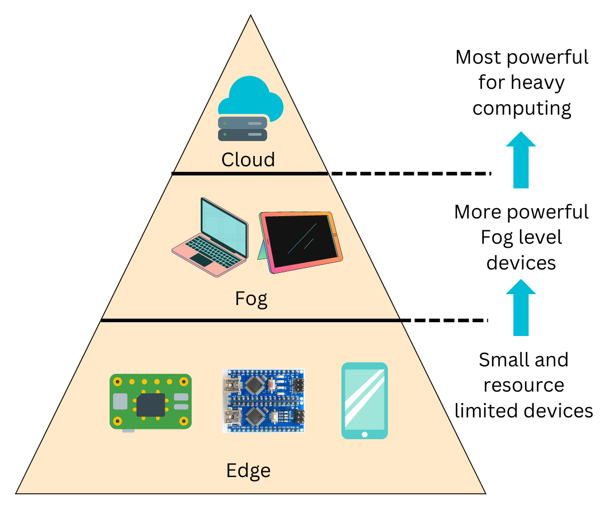
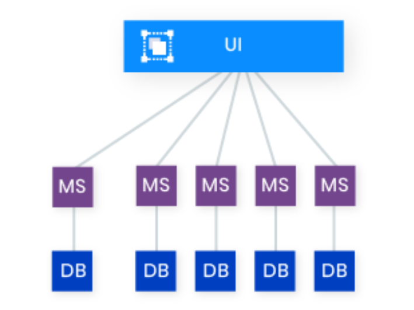
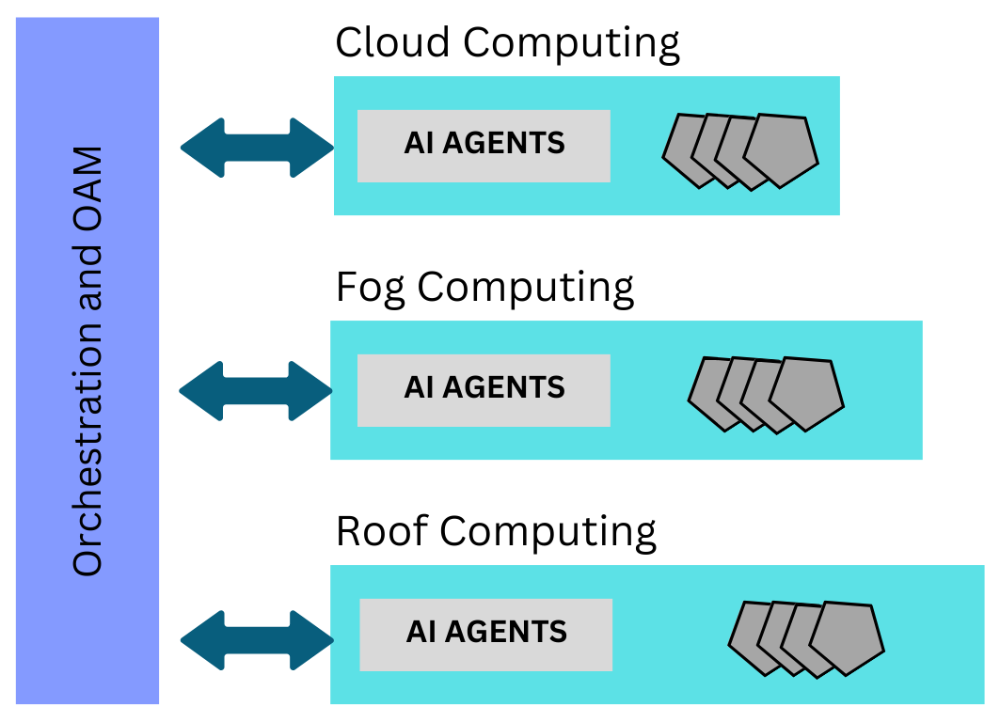
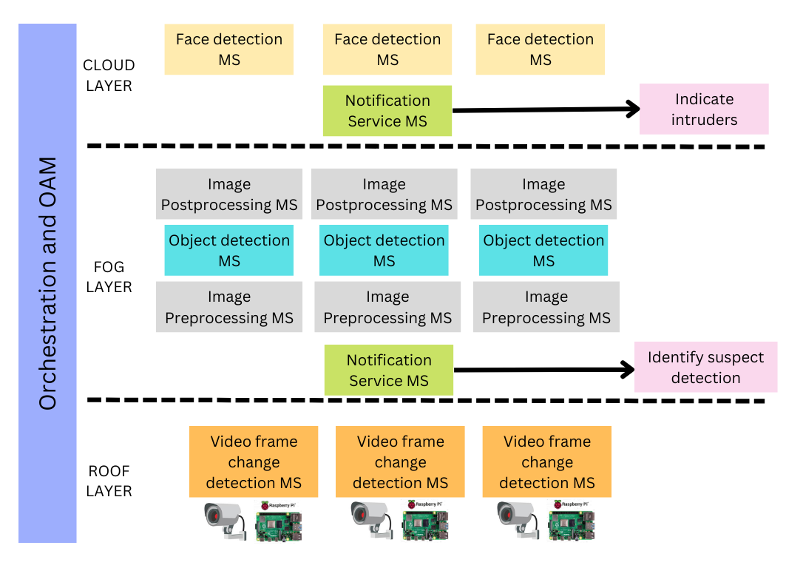
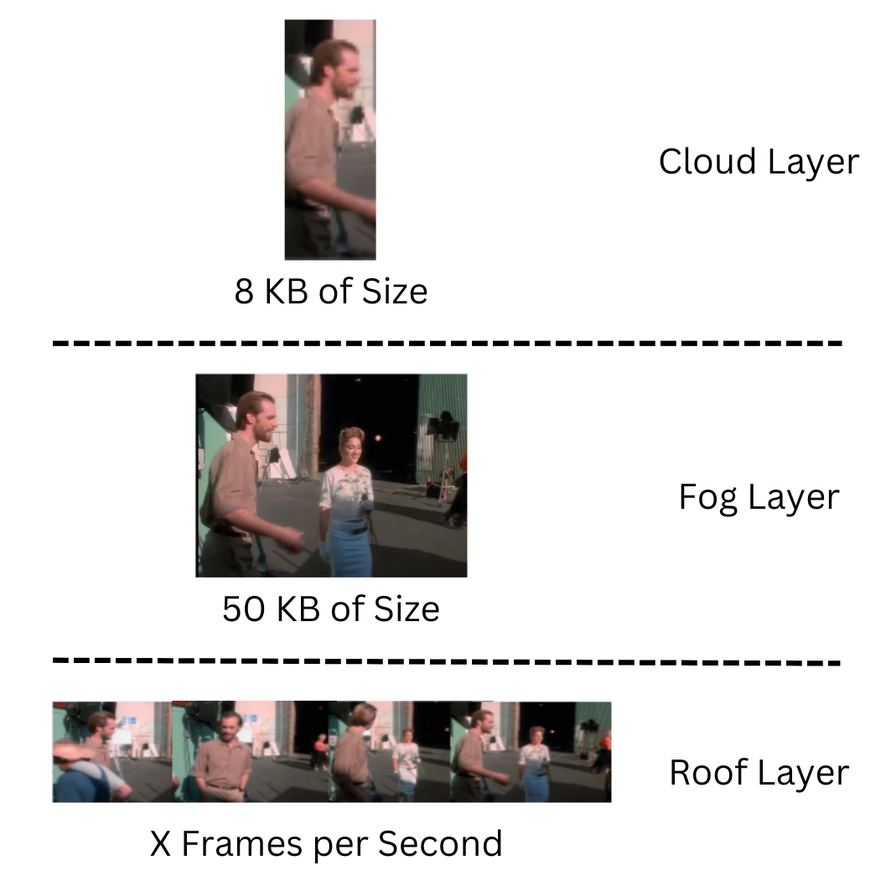

[comment]: # "This is the standard layout for the project, but you can clean this and use your own template"

# AI as a Microservice for Smart Edge of Things

#### Team

- E/16/022, Amarasinghe D.L.C., [email](mailto:e16022@eng.pdn.ac.lk)
- E/16/025, Amasith K.T.D., [email](mailto:e16025@eng.pdn.ac.lk)

#### Supervisors

- Dr. Upul Jayasinghe, [email](mailto:upuljm@eng.pdn.ac.lk)

#### Table of content

1. [Abstract](#abstract)
2. [Related works](#related-works)
3. [Methodology](#methodology)
4. [Experiment Setup and Implementation](#experiment-setup-and-implementation)
5. [Results and Analysis](#results-and-analysis)
6. [Discussion](#discussion)
7. [Future Work](#future-work)
8. [Conclusion](#conclusion)
9. [Links](#links)
<!-- 7. [Publications](#publications) -->

---

## Abstract

Cloud computing architecture has been proposed as a recent advancement to address the difficulties of implementing globally distributed Internet of Things (IoT) applications. The fundamental problem with existing IoT implementations is how to transfer and handle the enormous amounts of data produced by IoT devices on top of remote cloud computing resources. This causes significant delays and traffic congestion because the current mobile network is unable to send this much data without encountering an excessive amount of latency. While all data generated at edge devices must pass over the network and may be exposed in the course of transmission, this scenario may also result in privacy concerns when it comes to cloud computing. Since sensitive data must be obtained and handled in cloud computing environments, data privacy may also be jeopardized there. As an alternative to cloud computing and in order to decrease the sending of duplicate data to cloud-based resources, edge computing is discussed in the context of IoT. Therefore, computing at the edges allows faster analysis and time-critical data-driven decision-making capabilities, thus enabling rapid response, lower network latency, and reduction in traffic load. In comparison to monolithic solutions, microservice architecture in edge devices allows AI components to offer real-time IoT services in a distributed manner, so that data does not need to go through the network but can be processed at the local devices. Therefore, in order to achieve these capabilities, real-time deep learning AI algorithms can be designed at the edge using microservices. So, in this paper, we propose a novel architecture and test the implementation to address certain scenarios.

<!--
## Related works

#### Distributed Computing

Nikouei et al. propose an intelligent surveillance system where edge computing is used to provide solutions such as getting real-time responses, minimizing network overload, and having privacy and security of data. The system is expected to perform smart tasks of object detection and tracking with the intention of adding additional knowledge near edge devices. To achieve this, Edge-Fog-Cloud layered design has been implemented in the intelligent surveillance system and there are three layers in which the relevant functions of the system are grouped as shown in Fig.~\ref{fig1}. In order to identify each object of interest, video data is used to extract low-level features in layer 1. Layer 2 is responsible to identify the behavior of a targetted object for quick alerting while layer 3 analyzes historical statistical data and gets decisions through algorithm training and fine-tuning.

Figure 1: Edge Fog Cloud Hierarchical Architecture

#### Microservice Architecture

Application with a monolith architecture denotes having the frontend, backend, and database of the whole application as one block. The microservices architecture comes into the picture where the application can be divided into isolated, independent services that can carry out a distinct and well-defined functionality. An application based on microservice architecture can be loosely coupled so that each microservice can be individually maintained and scaled according to the requirements. The central process can orchestrate microservices to create workflows with the requests coming from services and APIs.

Figure 2: Microservice Architecture

Microservices web architecture has rearranged the monolithic architecture as shown in Figure 2. A single service can be updated independently without any interference from service termination while the application is performing its tasks. Here, the dependence between the services is eliminated since each service is an independent instance with its own data storage.

Myoung Lee et al. discuss how AI services that are deployed in centralized cloud resources following monolithic architecture are divided into functions and deployed as microservices that reside near the edge devices. Therefore, distributed microservices can be used to generate AI functionalities. In that case, each microservice carries out a small part of an AI task. These small tasks are responsible for AI functions such as regression analysis, classification, and data preprocessing.

#### Edge Computing with Microservices

Edge computing can be considered as a cloud computing extension deployed on the edge network. Due to the limited hardware resources, the typical applications running in cloud computing resources can not be deployed on edge devices. Significant tasks such as data processing, and resource monitoring can be done with edge computing, but it is necessary to apply appropriate efficient resource utilization methods. Edge applications are supported by microservices that can be developed and expanded easily, supporting the restricted computation and storage capacity of hardware on the edge. Considering application requirements, microservices can be distributed across computational resources. Therefore, edge computing platforms can use an application built using the microservice architecture.

#### Distributed AI with Edge Computing

Artificial Intelligence (AI) is widely used in a variety of applications related to IoT in the present context. End devices are producing data that is either utilized to build deep learning models or analyzed in real-time using deep learning. Here, Edge Computing where additional computation resources have come close to end devices can be identified as a viable solution to process AI computation quickly with low latency ensuring privacy, scalability, and bandwidth efficiency.

According to the edge learning paradigm, edge learning servers employ pre-processing and other fundamental learning techniques to the raw data they receive from end users in order to extract significant features. The deep learning cluster carries out the deep learning tasks based on the outputs from edge servers.

Data preprocessing enhances system processing power and enables real-time data processing capabilities even when there are resource-constrained devices. Therefore, data preprocessing steps which are considered comparatively lightweight can be done on edge devices and can reduce the amount of data to be offloaded. Chen et al. suggest offloading camera frames to a nearby edge server for DNN computation, only when a change is noticed otherwise, the end device supposes to track the camera frame. This scenario can be used to minimize data transfer delay by sending only the image frames required to be computed on an edge server.

## Methodology

#### Use Case

In both public and private sectors, video surveillance technology is now an essential tool for security purposes such as monitoring traffic, indoor spaces, and detecting crime and violence. These systems are characterized by numerous monitoring terminals, a vast surveillance scope, and an uninterrupted flow of video streams. However, video surveillance systems must now meet more significant demands for accurate data analysis and fast response times. As a result, there is an increasing need for these systems to enhance their capacity to process vast amounts of video data and provide quick, precise responses to potential security threats.

Many of these sophisticated surveillance applications need a lot of processing and storage power to handle the large amounts of contextual data generated by video sensors. Real-time transmission is dominated by video data, which puts a lot of strain on communication networks. So, it's critical to use novel approaches to manage this large data migration. The paradigm of cloud computing offers exceptional flexibility and is also scalable to accommodate the growing number of security cameras. However, there are substantial problems with the remote cloud-based smart surveillance architecture in real life.

Traditional surveillance systems rely on human operators to watch live video feeds, which is impractical for long periods of time and cannot scale to monitor many cameras. In contrast, the next-generation "smart" surveillance systems use advanced machine learning algorithms like deep learning and computer vision to detect suspicious behavior automatically. By reducing the need for human operators, smart surveillance systems can improve efficiency and accuracy while also learning from previous incidents to enhance detection capabilities over time.

#### Proposed Platform

The roof-fog-cloud hierarchical design shown in Figure 3 divides the functions in a smart surveillance system into three layers.

- Roof Layer: Extract frames that are detected for changes compared to the previous frame
- Fog Layer: Detect objects in frames and preprocess images for human recognition
- Cloud Layer: Human identification using face recognition techniques

Figure 3: Roof-Fog-Cloud Hierarchical Design

If all the operations are carried out locally at the network edge where the surveillance camera is placed and the decision is taken instantly, the least amount of latency and communication overhead would be realized. Yet, relying only on edge devices to complete all tasks is unfeasible. Thus, the findings are outsourced to the fog layer for object detection when the frame change detection and tracking jobs are completed. Given the processing capability, the computationally intensive face recognition processes can be placed on the cloud layer. In a smart surveillance system, more specifically object detection is vital to identify suspicious objects. At the same time, face recognition plays a significant role to identify intruders. These features can alert on suspicious detections using this system.

#### Microservice based Architecture

Distributed AI computations are implemented as microservices at three levels in our architecture: edge, fog, and cloud. The first step in this strategy is to identify AI services that can be divided into microservices. We found the video change detection microservice in the roof layer. Object detection microservices are identified in the fog layer, and a pipeline made up of preprocessing, object detection, and post-processing microservices is designed. We have also identified the need for a notification service microservice. A pipeline runs the pre-processing, detection, and post-processing services. Faces are detected using fog and their details are sent to the cloud-based face recognition microservice as shown in Figure 4. In addition, a notification service is used to alert intruders. Our architecture takes advantage of the benefits of distributed AI computations and microservices to improve the performance and efficiency of AI-based systems. Our architecture provides scalability and enables real-time processing by distributing AI computations into microservices at different levels, making it suitable for a wide range of applications.

Figure 4: Roof-Fog-Cloud Hierarchical Architecture

## Experiment Setup and Implementation

#### Microservices Implementation

All AI services and other preprocessing services are deployed across Roof, Fog, and Cloud layers depending on the computation power of each layer. The Roof layer consists of devices with low computational power. There, microservices to detect video frame changes are deployed as those microservices require limited processing power. For object detection, a certain level of processing power is required and those microservices are deployed across the Fog layer along with preprocessing and postprocessing microservices. The cloud layer can be used to deploy face identification and face recognition microservices which needs high computational and processing power.
We implemented all of the microservices in our architecture for distributed AI computations as microservices using the Python programming language and the Flask web framework. The Flask framework is a lightweight and adaptable framework for developing Python web applications. To make communication between microservices easier. The HTTP protocol is a widely used protocol for web application communication, and it provides a standard mechanism for exchanging data between microservices.

#### AI Services Implementation

##### Frame Change Detection Model

The video feed can be separated into frames and the model loops through the video frame-by-frame. In order to capture changes between frames, the difference between two consecutive frames is used. This is achieved by converting each frame to grayscale and then subtracting the pixel values of the current frame from the previous frame.

##### Object Detection Model

Real-time object detection is a computer vision task that involves detecting and localizing objects in a video stream in real time. YoloV5 (You Only Look Once Version 5) is a state-of-the-art deep learning algorithm that is capable of performing real-time object detection on a wide range of devices, including CPUs, GPUs, and mobile devices.

YoloV5 is a deep learning model that is based on the YOLO (You Only Look Once) family of object detection algorithms. It is designed to be lightweight and fast, which makes it ideal for real-time object detection tasks. This model uses a variant of the Darknet architecture, which is a convolutional neural network (CNN) designed for object detection. The network consists of several convolutional layers, followed by several residual blocks. The output of the network is a set of bounding boxes and class probabilities for each object detected in the input image.

A large dataset of labeled images named COCO (Common Objects in Context) is used to train the model. During training, the network learns to recognize different objects and their corresponding bounding boxes. The network is optimized using a loss function that penalizes incorrect predictions and encourages the network to make more accurate predictions.

To perform real-time object detection using YoloV5, the input video stream is first preprocessed to resize the frames to a fixed size and normalize the pixel values. The preprocessed frames are then fed through the YoloV5 network, which predicts the bounding boxes and class probabilities of the objects in the frame. The predictions are then postprocessed to remove duplicate detections and filter out low-confidence detections. Finally, the bounding boxes are drawn on the frame to visualize the detections.

##### Face Recognition Model

- Face Detection using MTCNN:
MTCNN (Multi-Task Cascaded Convolutional Neural Network) is a widely used face detection algorithm that consists of three stages: proposal network (P-Net), refinement network (R-Net), and output network (O-Net). The P-Net stage generates a set of candidate face regions, which are then refined by the R-Net stage to improve the accuracy of face detection. The final stage, O-Net, further refines the face regions and also generates facial landmarks.

- Face Recognition using FaceNet:
FaceNet is a deep learning model for face recognition that is based on a convolutional neural network (CNN) that is trained to extract high-dimensional feature vectors from faces. FaceNet does a mapping from face images to a compact Euclidean space where the distance between face embeddings reflects the similarity between faces.
The training process of FaceNet involves optimizing the CNN to minimize the distance between embeddings of the same person's face and maximize the distance between embeddings of different people's faces. Once the CNN is trained, it can be used to extract face embeddings from new face images, which can then be compared to the embeddings of known faces to perform face recognition.

## Results and Analysis

The proposed solution architecture addresses three main issues with conventional surveillance systems. Therefore, results can be evaluated on the following criterions.

#### Bandwidth

Surveillance cameras at the Roof layer capture live on-ground situations as a video feed. There, change-detected video frames are sent to the Fog layer for object detection. In order to recognize persons, detected human figures are cropped from the image frame. Those cropped images of humans are sent to the Cloud layer for face recognition. Fig.~\ref{fig5} shows how bandwidth utilization is minimized by sending the required portions from video feeds and image frames when data is transmitted to the upper layers.

Figure 5: Bandwidth Consumption over Roof-Fog-Cloud Architecture

Suppose the video feed captured from the camera has x frames per second. Assume that the video feed is T seconds in length and the average image frame size is 50 KB.

- __Conventional cloud processing:__

*Amount of data transferred = 50 * x * T*

- __Proposed Roof-Fog-Cloud architecture:__

If only frame change detect is y frames per second,
*Amount of data transferred from Roof to Fog = 50 * y * T*

If required portions of an image frame has the size of 8KB,
*Amount of data transferred from Fog to Cloud = 8 KB * (number of persons) * y*

x = 10 fps, y = 5 fps, T = 60 sec, Number of detected persons = ~2

__Amount of data transferred:__

- For conventional cloud processing : ~30 MB
- With our implementation : ~5 MB

#### Latency

The conventional cloud computing paradigm involves performing object detection in data centers located in the cloud. However, a proposed architecture allows for object detection to be carried out in the Fog layer. This approach enables the detection of suspect objects and potential threats quickly, without the need to go all the way up to the Cloud layer. By performing object detection in the Fog layer, which is closer to the devices generating the data, the response time can be significantly reduced. This can be especially important in fast and accurate object detection which is critical for safety and security. The Fog layer also has the benefit of reducing the amount of data that needs to be transmitted to the Cloud layer, which can help to reduce latency and network congestion. Overall, performing object detection in the Fog layer can offer numerous advantages over the conventional cloud computing paradigm.

#### Privacy

Surveillance cameras are commonly used to capture live on-ground situations and are capable of recording large amounts of data as videos. However, to minimize the amount of data transmitted, the system typically only sends change detected frames, meaning only frames that have noticeable changes from the previous ones. This data is then transmitted to the fog layer, where human figures are extracted from the video and sent to the cloud layer. This extraction process allows for sensitive data, such as personal information, to be kept secure and private, while still allowing for efficient monitoring and analysis of the footage. This approach helps to improve the overall efficiency and security of the surveillance system.

## Discussion

In designing an effective distributed computing system, several factors such as data privacy, security, latency, intended computation tasks, and available resources need to be taken into account. To optimize resource utilization and scalability, a popular solution is to implement AI functions as microservices. There are various strategies for integrating microservices into a distributed layered architecture. Notably, research has explored the use of edge computing for deep learning applications, as microservices need to be distributed across multiple layers in such an environment.

## Future Work

We have two primary options for future work. The first path is to orchestrate microservices, which is a difficult operation in our design. As the number of microservices rises, so does the complexity of coordinating them, making it a difficult process. As a result, we may experiment with various ways for coordinating these microservices, such as utilizing container orchestration frameworks like Kubernetes or other orchestration tools.
The second approach for future efforts is to divide AI services more lightly. We identified the AI services that can be distributed as microservices in our design, but there is still an opportunity to divide these services more lightweight. We can increase our architecture's scalability and efficiency by splitting the services into smaller, lighter components.

## Conclusion

In order to increase the range of IoT applications, edge computing has evolved as a new computational idea that addresses problems with the cloud computing paradigm. IoT systems have adopted the most advanced distributed computing design approaches, leveraging microservices to disperse the execution of AI services at the edge.

It's critical to compare various approaches for developing and processing AI models in a distributed setting with resource-constrained edge devices and microservices architectures.
-->
<!-- ## Publications -->
[//]: # "Note: Uncomment each once you uploaded the files to the repository"

<!-- 1. [Semester 7 report](./) -->
<!-- 2. [Semester 7 slides](./) -->
<!-- 3. [Semester 8 report](./) -->
<!-- 4. [Semester 8 slides](./) -->
<!-- 5. Author 1, Author 2 and Author 3 "Research paper title" (2021). [PDF](./). -->

<!--
## Links

[//]: # ( NOTE: EDIT THIS LINKS WITH YOUR REPO DETAILS )

- [Project Repository](https://github.com/cepdnaclk/e16-4yp-AI-as-a-Microservice-for-Smart-Edge-of-Things)
- [Project Page](https://cepdnaclk.github.io/e16-4yp-AI-as-a-Microservice-for-Smart-Edge-of-Things/)
- [Department of Computer Engineering](http://www.ce.pdn.ac.lk/)
- [University of Peradeniya](https://eng.pdn.ac.lk/)

[//]: # "Please refer this to learn more about Markdown syntax"

[//]: # "https://github.com/adam-p/markdown-here/wiki/Markdown-Cheatsheet"
-->
